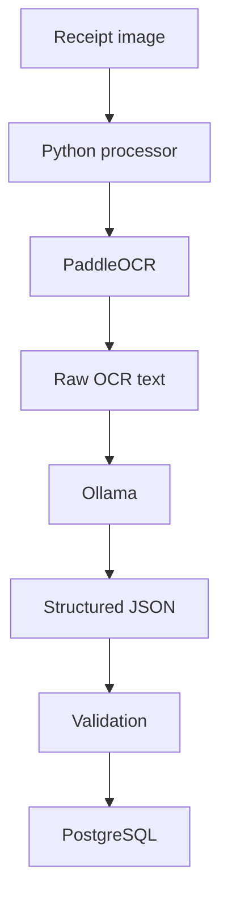

# Simplified Architecture

## Core Pipeline

## Component Responsibilities

| Component | Responsibility |
|---|---|
| Python | Coordinates the processing pipeline |
| PaddleOCR | Extracts visible text from receipt images |
| Ollama | Runs the local language model |
| Qwen/Llama | Converts OCR text into receipt fields |
| Validation | Checks structure and data types |
| PostgreSQL | Stores validated receipts and items |

## Initial Decisions

- Run all components locally.
- Do not use Docker initially.
- Process one receipt at a time.
- Use synchronous processing.
- Use a command-line interface first.
- Store receipt images on the local filesystem initially.
- Validate AI output before database insertion.
- Add n8n only after the Python pipeline works.
- Add FastAPI only if an HTTP interface becomes necessary.

## Failure Boundaries

| Stage | Example failure |
|---|---|
| Input | Image does not exist |
| OCR | No readable text detected |
| Ollama | Local server unavailable |
| AI parser | Invalid JSON returned |
| Validation | Incorrect fields or data types |
| PostgreSQL | Connection or insertion failure |

A failed stage must not create a receipt that appears to have processed successfully.